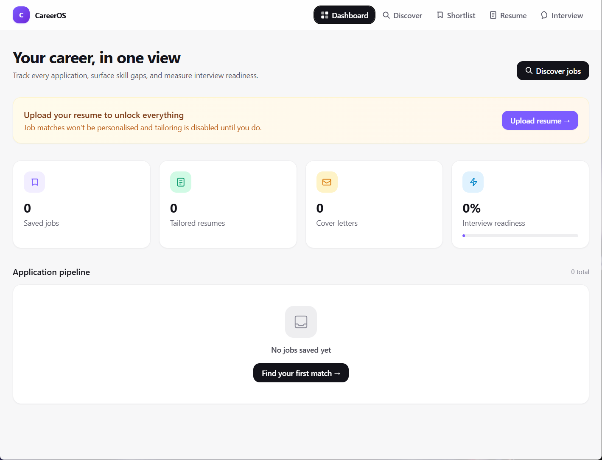
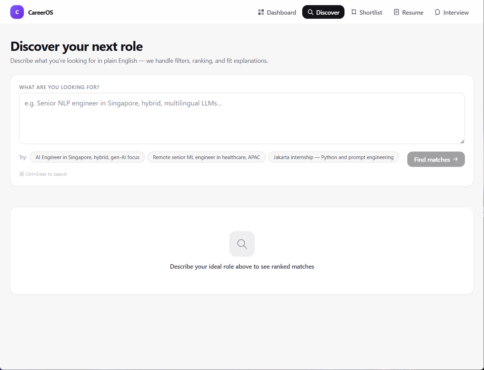
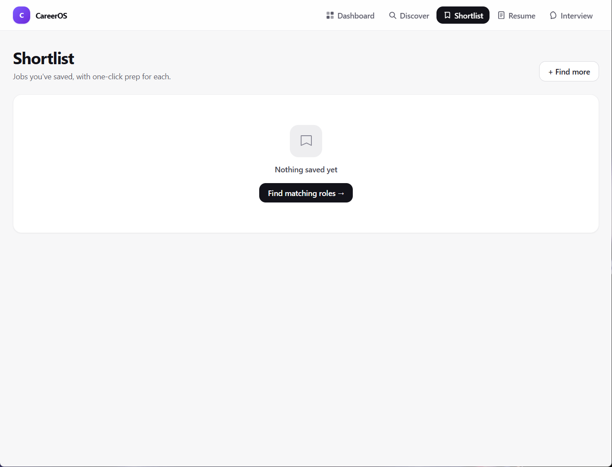
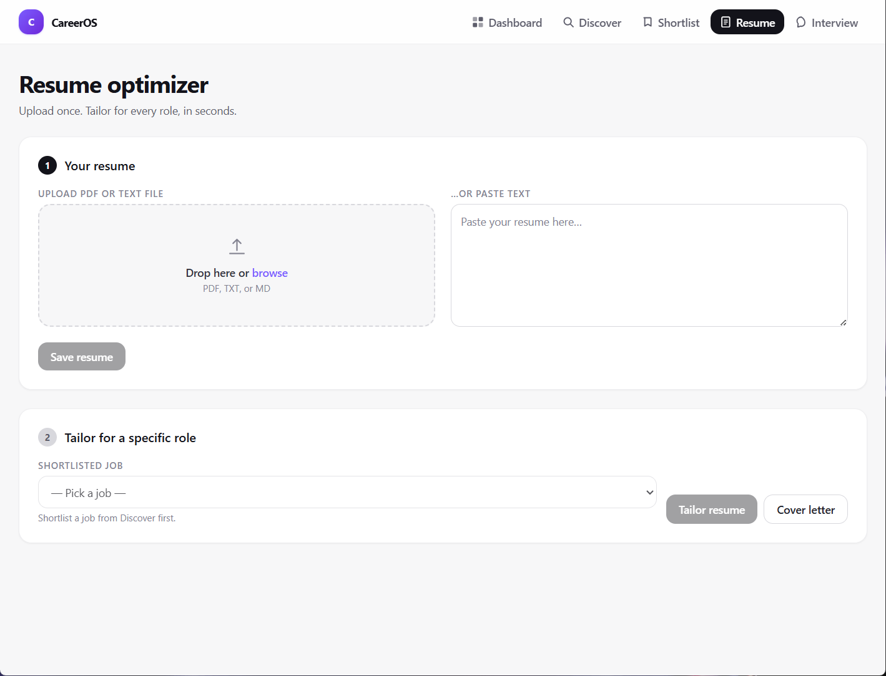
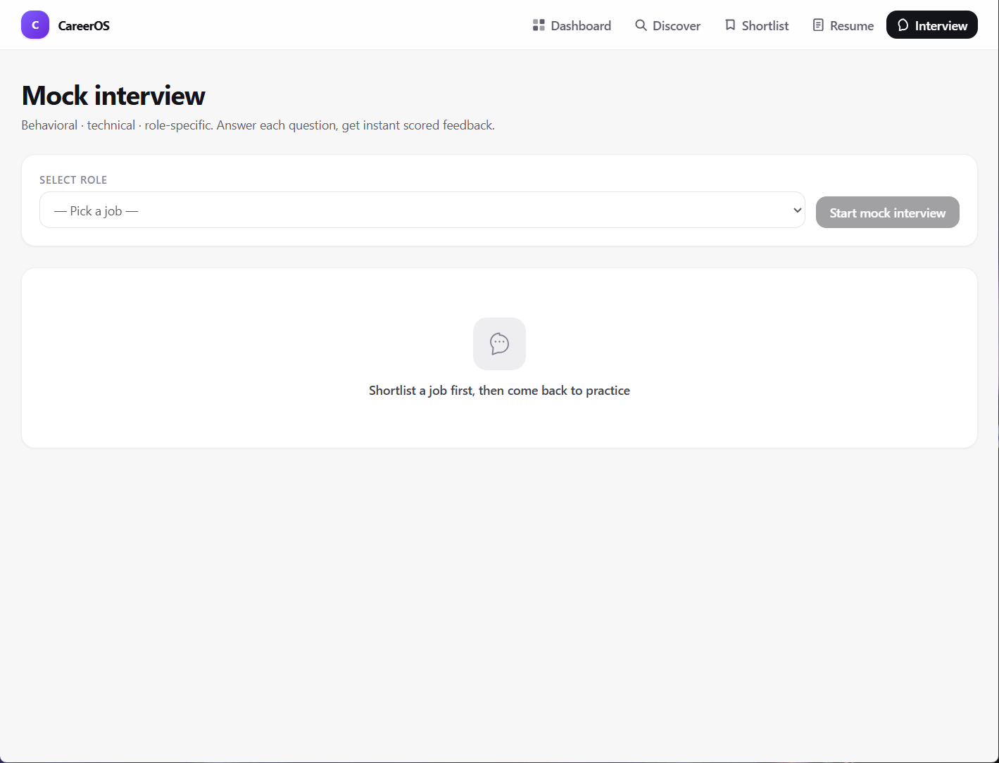

# CareerOS

Your AI career copilot — **discover** roles, **shortlist** the good ones, **tailor** your resume, **prep** for interviews, and **track** the whole pipeline from one dashboard.

Built for the **[Build with AI Cloud Jakarta 2026](https://gdg.community.dev/gdg-cloud-jakarta/)** build session — a hands-on hackathon by [GDG Cloud Jakarta](https://www.linkedin.com/company/gdg-cloud-jakarta) where teams had ~90 minutes to build and demo an AI-powered app using [Antigravity IDE](https://antigravity.dev). CareerOS was our entry in the **Career Growth** category.

This entire application — backend, frontend, UI/UX, and AI integration — was built entirely through **vibe coding and prompting** using Claude Code (Anthropic) inside Antigravity IDE. No hand-written boilerplate.

---

## Screenshots







---

## Features

| Feature                                                                                            | Where             |
| -------------------------------------------------------------------------------------------------- | ----------------- |
| Natural-language job discovery (NL query → structured filters → ranked + explained matches)        | `/discover`       |
| One-click shortlist with Kanban-style pipeline (saved → applied → interviewing → offer → rejected) | `/shortlist`, `/` |
| Resume upload (PDF or paste) → automatic skill extraction                                          | `/resume`         |
| Per-job resume tailoring + ATS keyword extraction                                                  | `/resume`         |
| Cover letter generator                                                                             | `/resume`         |
| Company dossier ("what to know before your interview")                                             | `/shortlist`      |
| AI mock interview: behavioral + technical + role-specific questions with scored feedback           | `/interview`      |
| Dashboard with pipeline, skill gaps across your shortlist, and interview readiness %               | `/`               |

---

## Architecture

```
career-os/
├── backend/          FastAPI + Gemini · in-memory store · mock job dataset
│   └── app/
│       ├── main.py               FastAPI entrypoint, CORS
│       ├── store.py              in-process state (single-user, resets on restart)
│       ├── data_utils.py         shared job-loading helpers
│       ├── routers/              profile · jobs · resume · interview · dashboard
│       ├── services/             Gemini client (JSON + text helpers)
│       └── data/mock_jobs.json   curated SG/JKT job dataset
└── frontend/         Next.js 14 (App Router) + Tailwind CSS v3 · TypeScript
    ├── app/                      /, /discover, /shortlist, /resume, /interview
    ├── components/               NavBar · JobCard · Spinner
    └── lib/api.ts                typed client for backend
```

**Request flow:** Browser → Next.js catch-all proxy (`/api/[...path]`) → FastAPI on `:8000` — no CORS issues, no `NEXT_PUBLIC_` leakage.

---

## Running Locally

### 1. Environment

```bash
cp .env.example .env
# open .env and fill in your GEMINI_API_KEY
```

### 2. Backend (FastAPI)

```bash
cd backend
python3 -m venv .venv

# macOS / Linux
source .venv/bin/activate

# Windows (PowerShell)
.\.venv\Scripts\Activate.ps1

pip install -r requirements.txt
uvicorn app.main:app --reload --port 8000
```

Health check: `curl http://localhost:8000/` → `{"status":"ok","service":"CareerOS API"}`

### 3. Frontend (Next.js)

In a second terminal:

```bash
cd frontend
npm install
npm run dev
```

Open **http://localhost:3000**.

### 4. Configuration

| Env var          | Default                 | Notes                                                         |
| ---------------- | ----------------------- | ------------------------------------------------------------- |
| `GEMINI_API_KEY` | — (required)            | Get one at [aistudio.google.com](https://aistudio.google.com) |
| `GEMINI_MODEL`   | `gemini-2.5-flash`      | Any Gemini model ID works                                     |
| `API_BASE`       | `http://localhost:8000` | Used server-side by the Next.js proxy only                    |

---

## How to Use

1. **Upload your resume** at `/resume` — paste text or drop a PDF. Skills are extracted automatically.
2. **Discover jobs** at `/discover` — type a natural-language query (e.g. _"senior backend roles in Jakarta with Go"_).
3. **Shortlist** the ones you like — they appear in your pipeline on the dashboard.
4. **Tailor your resume** and generate a cover letter for each shortlisted role at `/resume`.
5. **Practice** with AI mock interviews at `/interview` — get per-answer scored feedback.
6. **Track progress** on the dashboard — move jobs through the pipeline and watch your readiness score rise.

---

## Contributors

This project was built as a team at **Build with AI Cloud Jakarta 2026** (#BuildWithAICloudJakarta).

| Name                   | GitHub                                             |
| ---------------------- | -------------------------------------------------- |
| Nur Wahid Azhar        | [@DECode-studio](https://github.com/DECode-studio) |
| Jevania Jevania        | [@jevania](https://github.com/jevania)             |
| Lile Manalu            | [@Lilemanalu](https://github.com/Lilemanalu)       |
| Made Agus Andi Gunawan | [@joeinus134131](https://github.com/joeinus134131) |

---

## Tech Stack

| Layer       | Technology                                             |
| ----------- | ------------------------------------------------------ |
| AI          | Google Gemini 2.5 Flash via `google-genai` SDK         |
| Backend     | Python 3.11 · FastAPI · Uvicorn · PyPDF                |
| Frontend    | Next.js 14 (App Router) · TypeScript · Tailwind CSS v3 |
| Dev tooling | Antigravity IDE · Claude Code (vibe coding)            |
