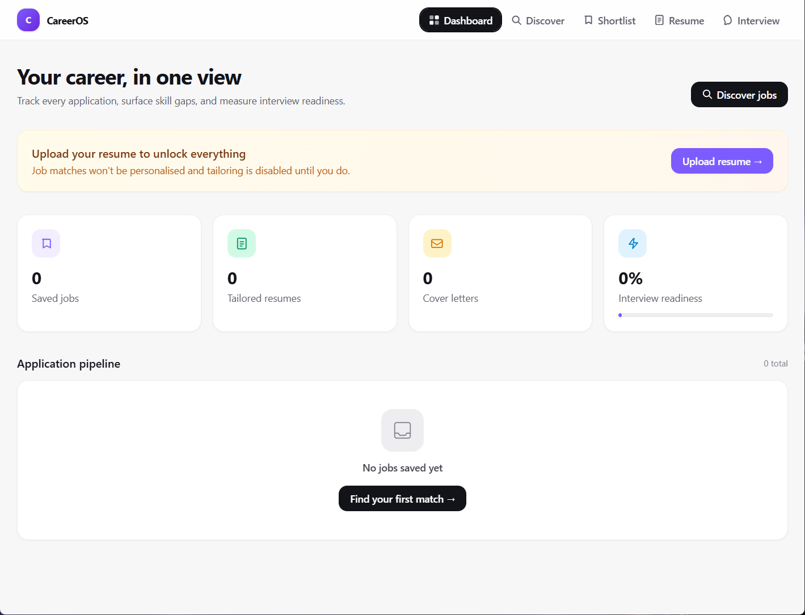
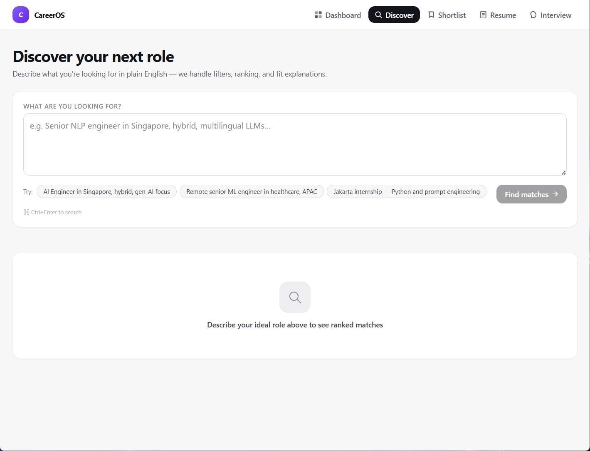
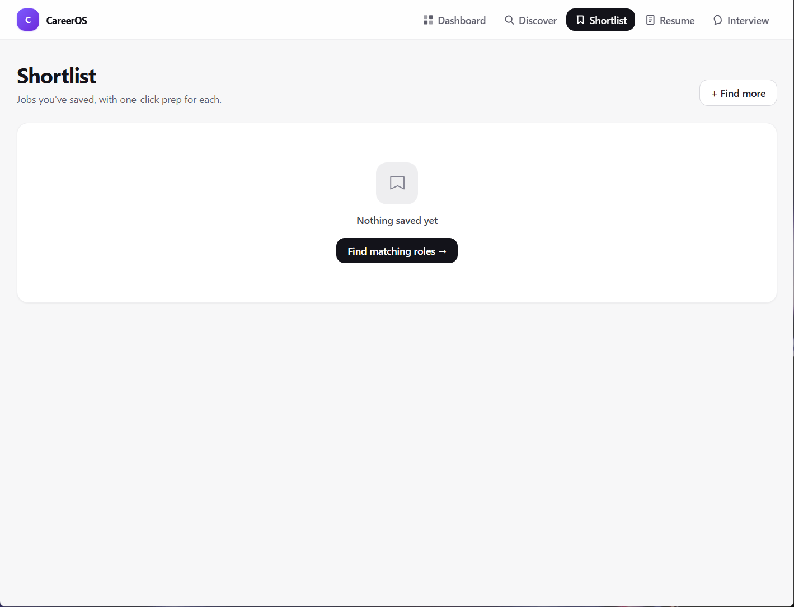
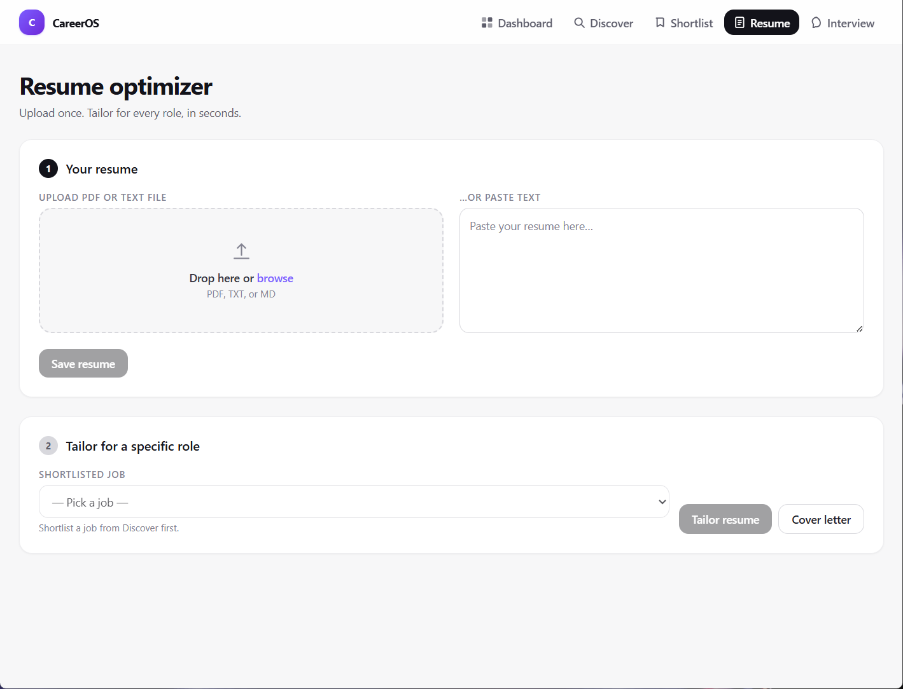
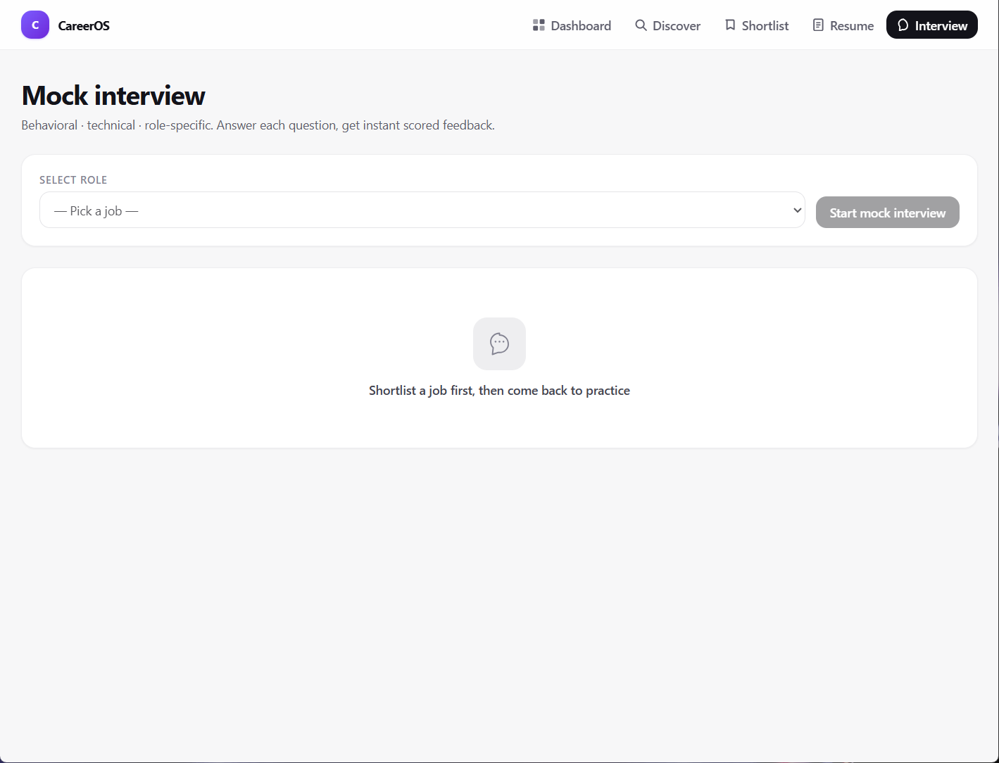

# Career OS

Career OS brings a personal job-search workflow into five pages: discover curated roles, keep a shortlist with notes and stages, tailor application documents, practice interviews, and track preparation. Profile facts, documents, preparation briefs, interview sessions, answer drafts and feedback are saved in SQLite and restored after navigation or restart.

This is a local single-user app. Its ten curated SG/JKT/APAC sample jobs are not live listings, and sample application links may be placeholders. Preparation briefs derive from the posting rather than external company research. Practice scores describe evaluated answers; they do not predict hiring success.

The original application was built through prompting and vibe coding for the **[Build with AI Cloud Jakarta 2026](https://gdg.community.dev/gdg-cloud-jakarta/)** build session by [GDG Cloud Jakarta](https://www.linkedin.com/company/gdg-cloud-jakarta), where teams had about 90 minutes to build and demo an AI app using [Antigravity IDE](https://antigravity.dev). The current implementation extends that demo with durable saved work, validated model output and automated checks.

## Workflows

| Page | What it does |
| --- | --- |
| `/` | Pipeline, saved-document counts, active skill gaps, practice score and evaluated-answer count |
| `/discover` | Natural-language search with strict explicit filters, separate query relevance/profile fit and a labeled local fallback |
| `/shortlist` | Independent stage/notes updates and explicit posting-brief generation |
| `/resume` | PDF/TXT/MD or pasted-text upload, editable profile review, atomic replacement with Cancel, tailored resume and per-tone cover letter |
| `/interview` | Six mixed-category questions, saved drafts, rubric feedback, session history and retained preparation |

Generated work remains readable after profile edits and is marked outdated. Failed regeneration preserves the last successful output. Removing a role from the shortlist retains its preparation, accessible through the role selectors. New interview questions archive the previous session only after successful generation.

## Stack and structure

| Layer | Technology |
| --- | --- |
| Frontend | Next.js 16.3.8 App Router, React 19.3.0, strict TypeScript, Tailwind CSS v3, SWR, Zod and safe Markdown |
| Backend | Python 3.11+, FastAPI, Pydantic, SQLite, Uvicorn and PyPDF |
| Model | Async Google Gemini through `google-genai` 2.28.0, provider JSON schemas and factual/rubric validation |
| Checks | pytest/HTTPX/Ruff, Vitest/Testing Library, Playwright/axe and GitHub Actions |

```text
backend/app/
  main.py                  Injectable FastAPI app and error handlers
  repository.py            SQLite migrations and saved-work lifecycle
  schemas.py               Strict request/profile contracts
  data_utils.py            Validated shared catalog loaders
  data/mock_jobs.json      Ten stable curated sample roles
  routers/                 Profile, jobs, documents, interviews, dashboard
  services/                Async Gemini, output schemas/prompts, local matching
frontend/
  app/                     Five pages, shared styling, server API proxy
  components/              Shared accessible saved-work controls
  lib/                     Zod contracts, typed API, errors/deadlines, SWR
  tests/                   Unit, mocked-browser and real integration checks
```

Browser → Next `/api/[...path]` proxy → FastAPI → SQLite/catalog/Gemini. `API_BASE` stays server-only. SQLite uses WAL, foreign keys, short transactions and a five-second busy timeout; no transaction spans generation. Blocking database/PDF operations run outside the event loop. See [ARCHITECTURE.md](ARCHITECTURE.md) for API and lifecycle details.

## Run locally

Use Python 3.11 or later and Node.js 24. Copy `.env.example` to root `.env` and set `GEMINI_API_KEY` to enable AI actions. Saved-resource reads, profile editing and local search fallback remain usable without a key. Accounts, public deployment, live job feeds, embeddings and background queues are outside the current scope.

From the repository root:

```sh
cd backend
python -m venv .venv
```

Activate the environment with `.\.venv\Scripts\Activate.ps1` in Windows PowerShell, or `source .venv/bin/activate` on macOS/Linux. Then:

```sh
python -m pip install -r requirements-dev.txt
python -m uvicorn app.main:app --host 127.0.0.1 --reload --port 8000
```

The health endpoint at `http://127.0.0.1:8000/` returns `{"status":"ok","service":"CareerOS API"}`. In a second terminal, from the repository root:

```sh
cd frontend
npm ci
npm run dev
```

Open `http://127.0.0.1:3000`. Use `npm run build` and `npm run start` for production Next locally.

## Configuration

Backend dotenv precedence is process environment, root `.env`, then `backend/.env`; later files do not replace values already set. Next runs from `frontend/` and needs its own process environment or `frontend/.env.local` for proxy configuration.

| Setting | Default / behavior |
| --- | --- |
| `GEMINI_API_KEY` | Required for AI generation; get a key from [Google AI Studio](https://aistudio.google.com) |
| `GEMINI_MODEL` | Optional global override; an existing explicit selection is preserved |
| `GEMINI_MODEL_EXTRACTION`, `GEMINI_MODEL_SEARCH` | Per-operation overrides; both otherwise default to `gemini-3.5-flash-lite` |
| `GEMINI_MODEL_WRITING` | Writing group override; default writing/feedback model is `gemini-3.8-flash` |
| `GEMINI_MODEL_TAILOR`, `_COVER_LETTER`, `_DOSSIER`, `_QUESTIONS`, `_EVALUATION` | Individual writing-operation overrides; take precedence over writing group/global |
| `CAREEROS_DB_PATH` | `backend/.data/careeros.sqlite3`; use an absolute custom path, since relative overrides use process cwd |
| `API_BASE` | `http://127.0.0.1:8000`; set for the Next process only, without `NEXT_PUBLIC_` |

The default database directory is ignored. It stores personal resume/answer content locally. Never commit credentials, personal source material or database files. Prior in-memory demo state cannot be recovered automatically.

Uploads accept PDF/TXT/MD only, up to 5 MiB, 25 PDF pages and 40,000 text characters. TXT/MD files must be UTF-8. Encrypted, malformed or textless scanned PDFs produce actionable errors; scanned files need OCR or pasted readable text. A replacement is saved only after parsing/extraction succeeds.

Gemini calls allow two concurrent operations per process, a 60-second total deadline and at most one transient transport/server retry. Quota and invalid/blocked/empty output are not automatically retried. Successful saved generation is cached by its inputs, source revision, model and prompt version; refresh is explicit. Revision/session/answer guards reject obsolete results with 409. Logs record latency/status/token counts without candidate content. Source-excerpt checks improve grounding but do not prove complete semantic accuracy.

## Checks

From `backend/`, with the virtual environment activated:

```sh
python -m ruff check app tests tools
python -m pytest -q
```

From `frontend/`:

```sh
npm run test
npm run lint
npm run typecheck
npm run build
npx playwright install chromium
npm run test:e2e
npm run test:integration
```

The first browser suite mocks API responses. The separate integration suite starts real Next and FastAPI against an isolated SQLite file with fake Gemini; it checks multipart forwarding, actual backend restart persistence, downloads, history, failed generation, all five pages at 320/390/768/1280 px, keyboard use, 200% zoom and serious accessibility violations. It does not send live model requests. Temporary databases/reports are under ignored `output/` and `frontend/test-results/`.

The integration harness uses ports 3124, 8124 and 8125. Test-only backend/supervisor controls bind localhost and are not part of the production app. It chooses `backend/.venv` if present, otherwise `python`; set `PYTHON_BIN` to another interpreter if needed. After a build, set `CAREEROS_INTEGRATION_PRODUCTION=1` to test production Next. For PowerShell:

```powershell
$env:CAREEROS_INTEGRATION_PRODUCTION = '1'
npm run test:integration
```

[GitHub Actions](.github/workflows/checks.yml) runs backend checks, frontend checks/build and both browser suites, including production integration.

### Optional live model probes

From `backend/`, with a configured key:

```sh
python tools/evaluate_models.py --live --output ../output/model-evaluation.json
```

`--live` explicitly opts into quota-consuming calls. The nine fixed synthetic probes cover sparse resumes, source instructions, aliases, conflicting requests, grounded documents, question mix and weak/strong answers. Reports contain validation checks, error codes and scores rather than source/generated personal content. A passing deterministic fixture does not establish live accuracy, and one live sample per case does not establish general accuracy.

During this improvement pass, credentialed probes could not assess model output because the existing configured provider credentials were rejected. Deterministic schema, grounding, reliability and workflow checks are reported separately. Valid credentials are needed before drawing conclusions about live model behavior.

## Original demo screenshots

These screenshots show the original hackathon demo; they are not a record of the current UI.







## Contributors

The original project was built as a team at **Build with AI Cloud Jakarta 2026** (#BuildWithAICloudJakarta).

| Name | GitHub |
| --- | --- |
| Nur Wahid Azhar | [@DECode-studio](https://github.com/DECode-studio) |
| Jevania Jevania | [@jevania](https://github.com/jevania) |
| Lile Manalu | [@Lilemanalu](https://github.com/Lilemanalu) |
| Made Agus Andi Gunawan | [@joeinus134131](https://github.com/joeinus134131) |
